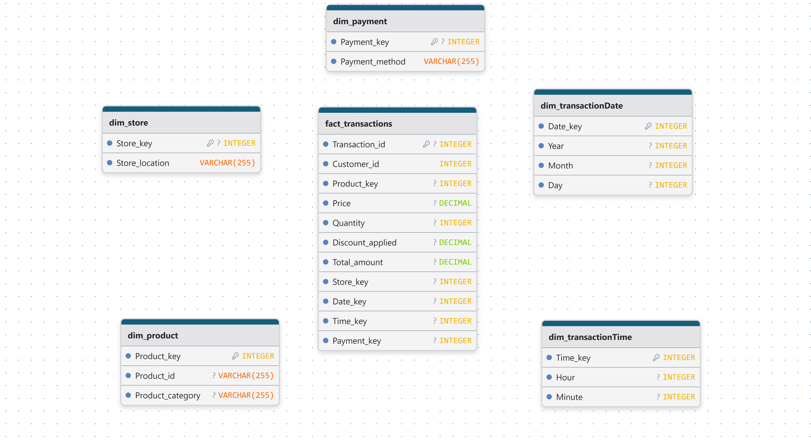

# 🛒 Pipeline End-to-End de Transacciones de Retail (EDA | Data Warehouse | ETL | Power BI)

**Proyecto integral de Business Intelligence enfocado en el análisis de transacciones de retail, ingeniería de datos y visualización para la toma de decisiones estratégicas.**

## 🎯 Contexto del Proyecto
Este proyecto simula un entorno corporativo real y se divide en 3 fases principales:

1. **Análisis Exploratorio (EDA):** Análisis profundo del dataset transaccional (tipo "sábana") en Jupyter Notebook utilizando Python (Pandas) y visualizaciones con `seaborn.objects` orientado a responder 5 preguntas de negocio (estan en el notebook). Se integraron consultas en SQL (PostgreSQL/DBeaver) para validar la calidad de datos, tipos, estadística descriptiva y descubrir patrones de consumo.
2. **Data Warehouse y Proceso ETL:** Para optimizar las consultas analíticas, se desnormalizó el dataset original migrándolo hacia un modelo de **Esquema Estrella (Star Schema)**. El ETL fue desarrollado modularmente en Python con 4 scripts independientes (Extracción, Transformación, Carga y un `main.py` orquestador) procesando +100.000 registros de forma eficiente. Desarrollado en un entorno WSL (Ubuntu) utilizando VSCode y Git.
3. **Business Intelligence (BI):** Desarrollo de un dashboard interactivo de 3 páginas en Power BI para el monitoreo de KPIs operativos y estratégicos, implementando modelado DAX avanzado.

## 🛠️ Stack Tecnológico
* **Lenguajes:** Python (Pandas), SQL, DAX
* **Bases de Datos:** PostgreSQL
* **Visualización:** Power BI, Matplotlib, Seaborn (`seaborn.objects`)
* **Herramientas y Entorno:** Jupyter Notebook, DBeaver, Git, VSCode, WSL (Ubuntu)

---

## 💡 Resumen Ejecutivo y Hallazgos (Insights)

* **Horarios de mayor actividad vs. Recaudación:** El pico máximo de volumen de transacciones ocurre a las 19:00 hs (impulsado por la categoría *Home Decor*); sin embargo, el mayor ingreso bruto se registra a la 01:00 hs. 
  * *Oportunidad de Negocio:* Ofrecer descuentos en horarios de baja actividad podría canibalizar ventas orgánicas. Una estrategia más rentable es aprovechar el tráfico natural de las 19:00 hs ofreciendo beneficios (ej. envío bonificado) condicionados a un ticket promedio más alto. El dashboard permite analizar esta estacionalidad dinámicamente.
* **Segmentación de Clientes y Concentración de Valor:** Mediante la implementación de un **Modelo RFM** (Recencia, Frecuencia, Monto), se identificó que el 95% de los usuarios son compradores únicos. Al cruzar esto con un análisis de Pareto, se descubrió una alta concentración de rentabilidad: aproximadamente el **50% de la base de clientes genera el 80% del revenue total**.
* **Comportamiento por Medio de Pago:** Los hábitos de consumo no presentan variaciones significativas según el método de pago utilizado, manteniendo un ticket promedio estable en todos los canales.

---

## 🏗️ Modelo de Datos (Star Schema)

El Data Warehouse fue diseñado bajo la metodología de Ralph Kimball, compuesto por un esquema en estrella dentro del esquema lógico `dw`:

* **Tablas de Dimensiones:** `dim_product`, `dim_store`, `dim_payment`, `dim_transactionDate`, `dim_transactionTime`.
* **Tabla de Hechos:** `fact_transactions`.



---

## 📂 Estructura del Repositorio

```text
retail-transactions-analysis/
│
├── dashboards/
│   └── analisis_transacciones.pbix                   # Archivo de Power BI
├── data/
│   └── raw/                                          # Dataset original (no subido por tamaño/privacidad)
├── database/
│   └── db_setup/                                     # Archivos .sql de schema y tablas (DDL/DML)
├── images/
│   ├── KPIs_ventas_metodo_pago.png                   # Captura de Power BI
│   ├── ventas_horas_dias.png                         # Captura de Power BI
│   ├── RFM_clientes_historico.png                    # Captura de Power BI
│   └── diagrama_db_retail_transactions_analysis.png  # Diagrama Entidad-Relación               
├── notebooks/
│   └── analisis_visual.ipynb                         # Limpieza, EDA y exploración RFM
├── src/                                              # Scripts .py del pipeline ETL
│   ├── extract.py
│   ├── transform.py
│   ├── load.py
│   └── main.py                                       # Orquestador del pipeline
├── README.md
├── requirements.txt
└── .gitignore
